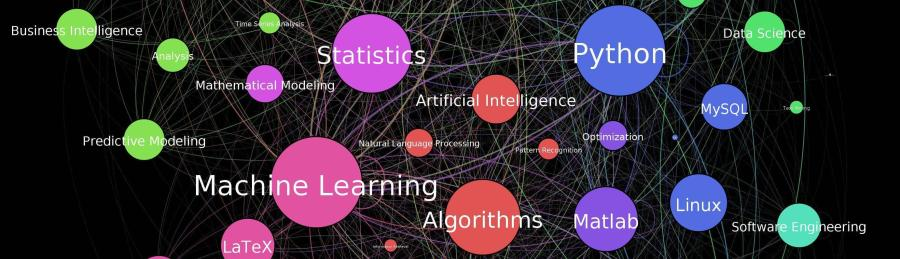

   

  

# Luciano Mancuso
Cientista de Dados - Panorama Doze

Pós graduado em Business Intelligence, possui larga experiência na área de TI, com mais de 20 anos no mercado. Atualmente é Sócio da empresa Panorama Doze onde presta serviços de consultoria principalmente na área de Ciência de Dados, Tour Virtual e Representação Comercial.

Professor durante 8 anos na área financeira, estatística, banco de dados, análise de sistemas, desenvolvimento de sistemas e Plano de negócios e também Coordenador Adjunto do curso de Administração na faculdade IESB de Brasília.

Formado em Administração de Empresas pela UnB também cursou MBA em Marketing Digital. 

**Links:**
* [Blog](http://www.dadosnanuvem.com.br)
* [LinkedIn](https://www.linkedin.com/in/luciano-mancuso-ti)

## Projetos:

* **Amálise do Dataser do AirBnB:** //https://bit.ly/2L2cMwy

